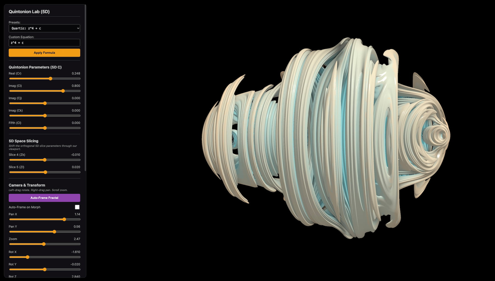
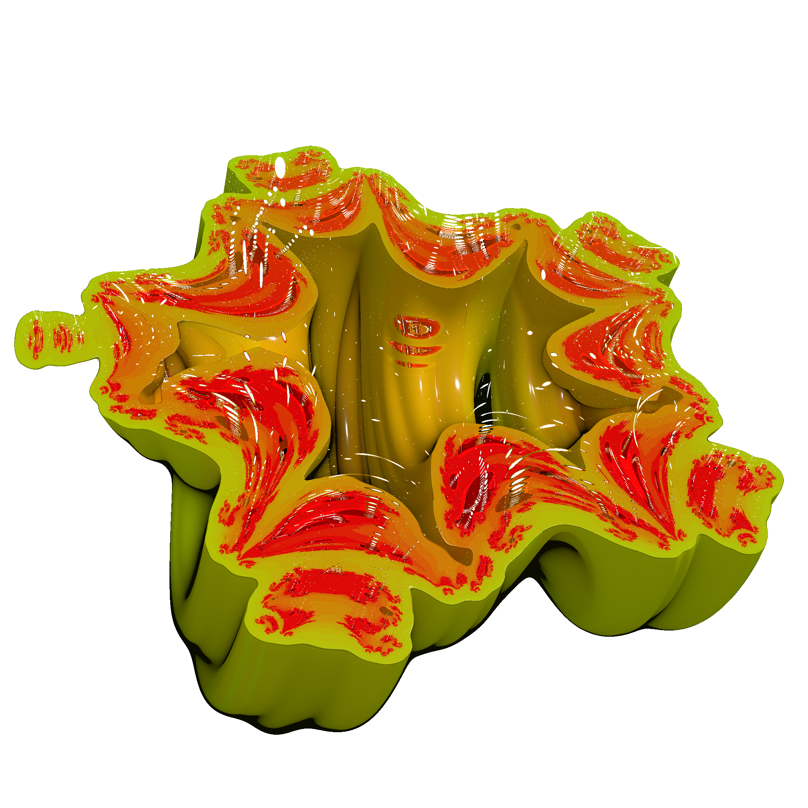
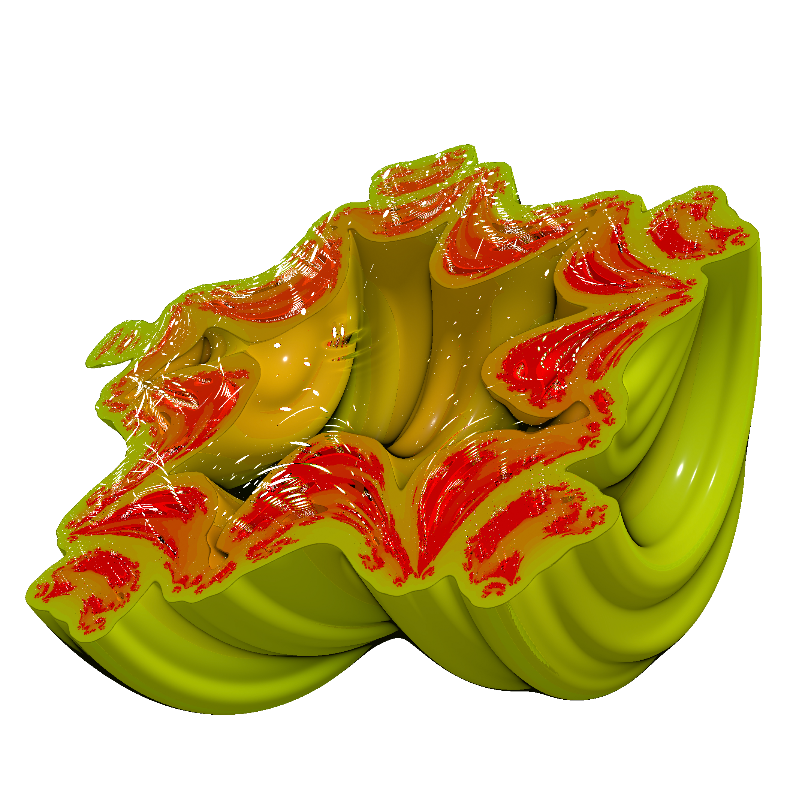
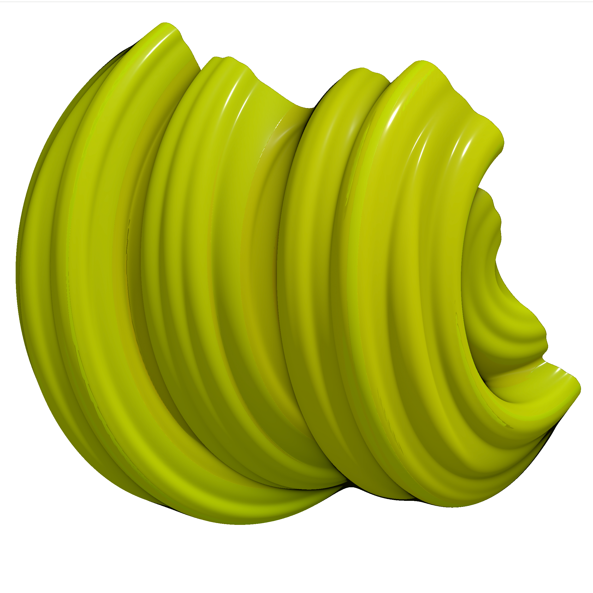
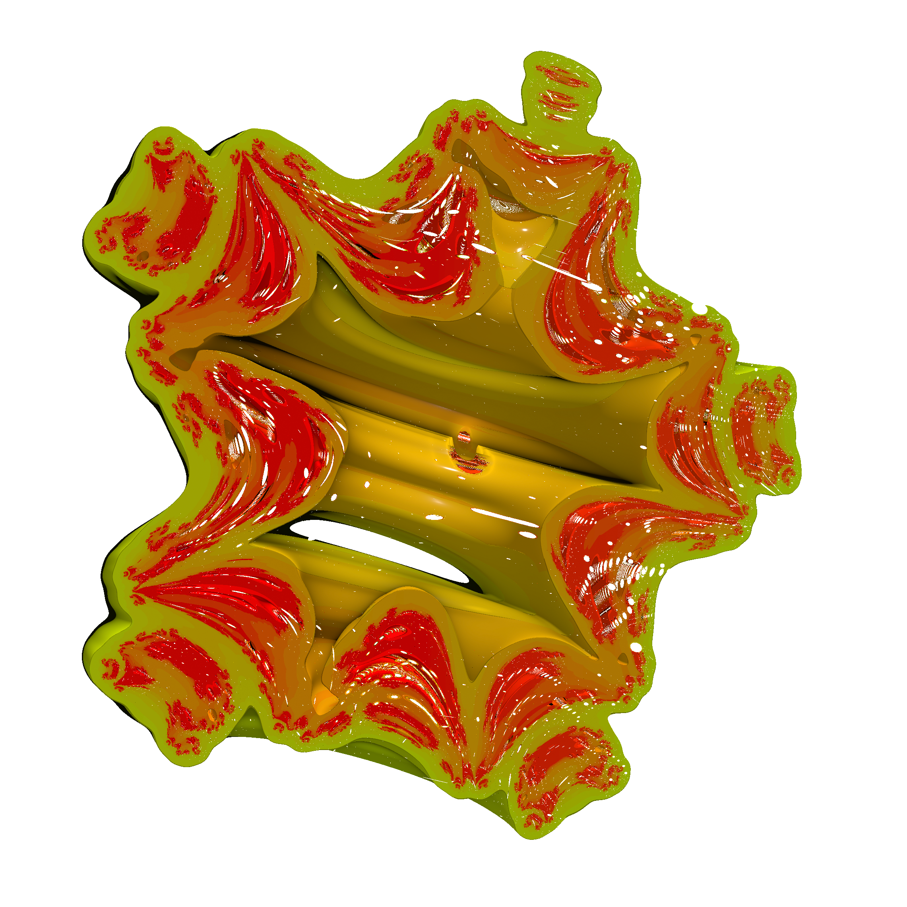

# Quaternion-Julia-Fractal

# The Project
Behind this Project stand the idea to build a very small solution, to show Julia Fractals on a Web Plattform. As usual with the help og Gemini & co i developed a few Fractal building plattforms. All accessible over my Google Site (https://sites.google.com/view/math-art-projects/fractals/quaternion-fractal-claude)

# Key Features
* You have many slider to adjust multiple fractal parameter.
* You can easily make a small animation - just by adjusting the start and end values
* You can export images in several resolutions 1k to 4k
* you can export a (reduced) 3D obj file
* There are several templates integrated

# Screen Shot (click to visit)

| Object | Preview |
| :--- | :--- |
|  |  |
|  |  |
